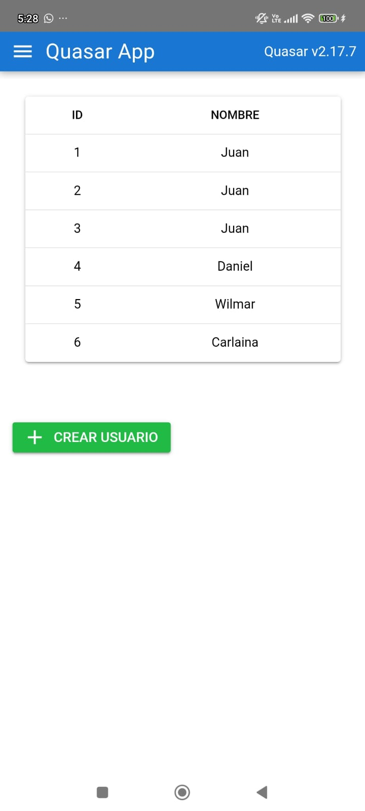

# SIMPLE INTEGRACION DE QUASAR Y SQLITE

Node version 20

## Install the dependencies
```bash
yarn
# or
npm install

quasar build

npx cap sync android

npx cap open android
```




Debe tener instalado Android Studio para ejecutar la aplicación en su dispositivo movil